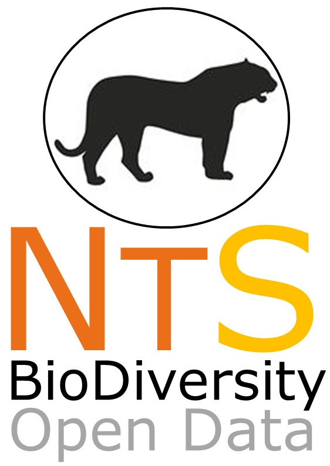

# NEOTROPICAL SERIES: Data on the biodiversity within Neotropics
--------------------------------------------------------
### ***NEOTROPICAL CARNIVORES: a data set on carnivore distribution in the Neotropics***

Mammalian carnivores are considered a key group in maintaining ecological health and can indicate potential ecological integrity in landscapes where they occur. Carnivores also hold high conservation value and their habitat requirements can guide management and conservation plans. The order Carnivora has 84 species from 8 families in the Neotropical region: Canidae; Felidae; Mephitidae; Mustelidae; Otariidae; Phocidae; Procyonidae; and Ursidae. Herein, we include published and unpublished data on native terrestrial Neotropical carnivores (Canidae; Felidae; Mephitidae; Mustelidae; Procyonidae; and Ursidae). NEOTROPICAL CARNIVORES is a publicly available data set that includes 99,605 data entries from 35,511 unique georeferenced coordinates. Detection/non-detection and quantitative data were obtained from 1818 to 2018 by researchers, governmental agencies, non-governmental organizations, and private consultants. Data were collected using several methods including camera trapping, museum collections, roadkill, line transect, and opportunistic records. Literature (peer-reviewed and grey literature) from Portuguese, Spanish and English were incorporated in this compilation. Most of the data set consists of detection data entries (n = 79,343; 79.7%) but also includes non-detection data (n = 20,262; 20.3%). Of those, 43.3% also include count data (n = 43,151). The information available in NEOTROPICAL CARNIVORES will contribute to macroecological, ecological, and conservation questions in multiple spatio-temporal perspectives. As carnivores play key roles in trophic interactions, a better understanding of their distribution and habitat requirements are essential to establish conservation management plans and safeguard the future ecological health of Neotropical ecosystems. Our data paper, combined with other large-scale data sets, has great potential to clarify species distribution and related ecological processes within the Neotropics.
 
The original data set is fully available as Supporting Information in the ECOLOGY repository.
Updated versions of NEOTROPICAL CARVIVORES data set can be accessed in this NEOTROPICAL SERIES Github repository.

This compilation was coordinated by Mariana Nagy-Reis/U of A [[mariana.nbreis@gmail.com](mailto:mariana.nbreis@gmail.com)], Julia Oshima/UNESP-Rio Claro [[juliaoshima@yahoo.com.br](mailto:juliaoshima@yahoo.com.br)], Claudia Kanda/UNESP-Rio Claro [[claudiakand@gmail.com](mailto:claudiakand@gmail.com)], Francesca Palmeira [[yagouaroundi@yahoo.com.br](mailto:yagouaroundi@yahoo.com.br)], and Fabiano Melo/UFG [[fabiano_melo@ufg.br](mailto:fabiano_melo@ufg.br)], under the supervision of Ronaldo Morato /CENAP&ICMBio [<ronaldo.morato@icmbio.gov.br>], **Mauro Galetti/UNESP-Rio Claro** 
and **Milton Ribeiro/UNESP-Rio Claro**.

##Data collection started in April 2018. 
##Manuscript was accepted in May 2020.
